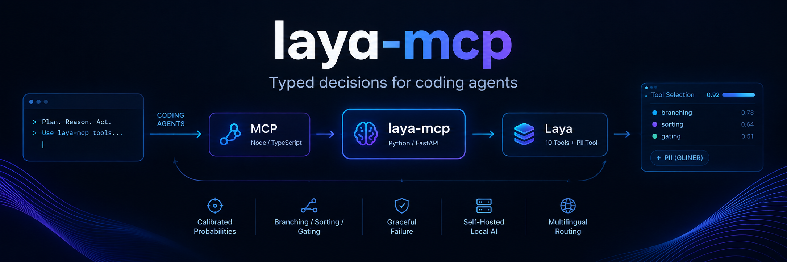
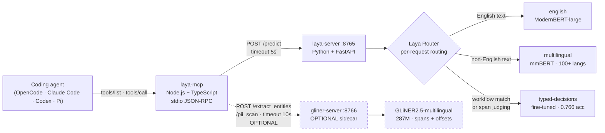
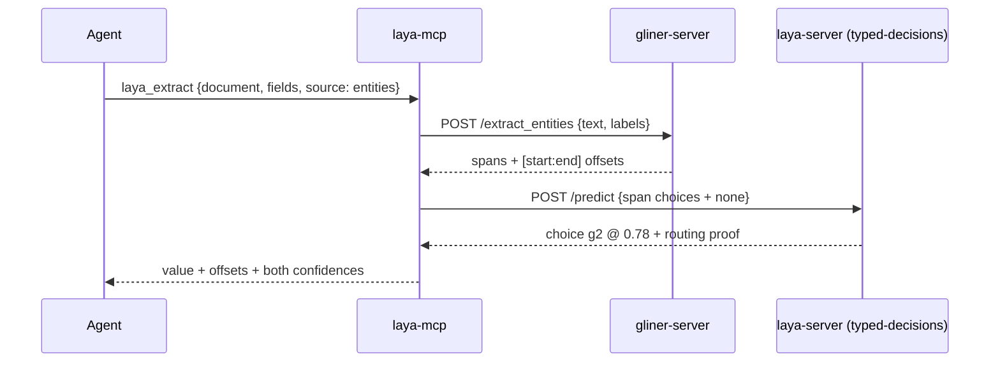
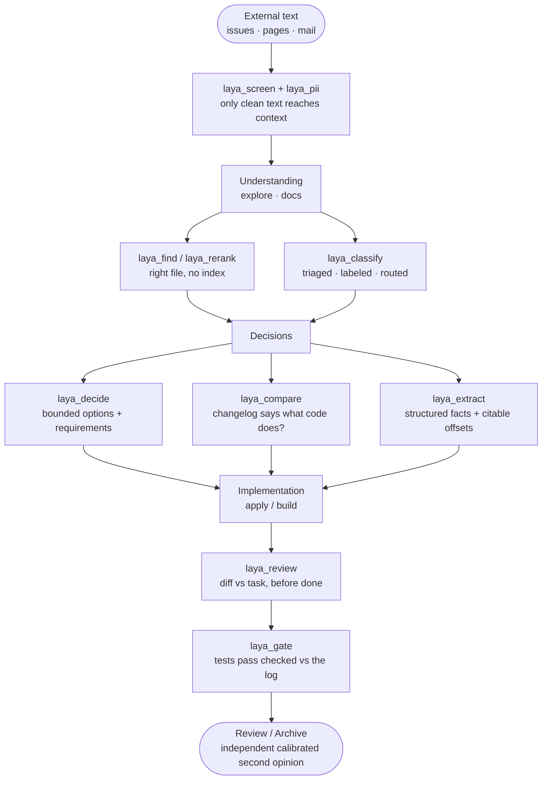

<p align="center">
  
</p>

<p align="center">
  
  
  
  
  
</p>

<p align="center">
  <b>Give your coding agent judgment calls instead of vibes.</b><br>
  Eleven MCP tools backed by local decision models — calibrated probabilities
  your code can branch on, sort by, and gate with.
  <br><br>
  <a href="#quickstart">Quickstart</a> ·
  <a href="#tools">Tools</a> ·
  <a href="#gentle-ai-orchestrator-policy-recommended">Gentle-AI</a> ·
  <a href="#diagnose-with-doctor">Doctor</a>
</p>

---

## What is this

Large language models generate *text*. When your agent needs a *judgment*
— is this a jailbreak? which file answers the question? is this diff safe
to merge? — you are coercing a text generator into a decision machine,
then parsing the answer back and hoping the format holds.

`laya-mcp` skips that round-trip. It exposes **System One decision models**
as MCP tools: state in, **typed answers with calibrated probabilities**
out. No text generation, nothing to parse, nothing to hallucinate.

- 🧠 **Laya** ([NandhaKishorM/laya](https://huggingface.co/convaiinnovations/laya),
  Apache 2.0) — `choice` / `score` / `noul` answers in ~33 ms, trained
  with RLCD so honest probabilities are the only way to maximize reward.
- 🔍 **GLiNER2.5** ([fastino/gliner2.5-multi-v1](https://huggingface.co/fastino/gliner2.5-multi-v1),
  Apache 2.0) — zero-shot span extraction with character offsets, PII and
  secrets included. Rule of the house: **GLiNER proposes, Laya disposes.**
  Spans locate, calibrated probabilities gate.
- 🌍 **Multilingual.** Spanish first-class: entity extraction, PII scan
  and classification verified live in Spanish.
- 💸 **$0, self-hosted, private.** No API keys, no per-token billing, no
  data egress. CPU-friendly.
- 🔌 **Optional by design.** If the servers are down — or never
  installed — your agent works exactly as before. Zero tools advertised,
  zero crashes, zero slowdowns.

The tool shapes follow
[`jkudish/jev-mcp`](https://github.com/jkudish/jev-mcp) (the reference
Jev MCP server) and
[`itsmostafa/typesafe-mcp`](https://github.com/itsmostafa/typesafe-mcp),
with a self-hosted backend instead of a hosted API.

---

## See it work

Real outputs from a live session (OpenCode + Gentle-AI orchestrator):

```
> Usá laya_pii para escanear: "Escribí a juan.perez@acme.com. Token: ghp_AbC123xYz."

action: block — secrets detected, redactá antes de que entre a cualquier contexto.
  - email ......... [10:29] juan.perez@acme.com (0.98)
  - token_secreto . [38:51] (0.99)
```

```
> laya_extract { document: "María García trabaja en Acme España en Madrid.",
                 source: "entities",
                 fields: [{ id: "persona" }, { id: "lugar" }] }

persona → "María García" [0:12]   lugar → "Madrid" [39:45]
```

```
> laya_review { request: "tolerate empty stdin config", diff: "…" }

correctness 1.63 · spec_match 1.65 · test_gap 0.45 · safe_to_apply 0.59
action: review   ← correctly flagged the missing test coverage
```

---

## Quickstart

**Requirements:** Python 3.10+, Node.js 20+, bash, ~1.7 GB disk for the three
Laya checkpoints (+ ~594 MB if you add GLiNER), no GPU needed (CPU works;
CUDA/MPS used when available). On Windows, run everything from git-bash
(the installer, `doctor.sh` and the `start_*.sh` scripts are bash).

```bash
git clone https://github.com/andragon3110/laya-mcp.git
cd laya-mcp
./install.sh                 # base: 10 Laya tools
# ./install.sh --with-gliner # + span extraction & PII tool
```

The installer is idempotent, touches only `$HOME/laya-mcp`, pre-downloads
the models, and generates `start_laya.sh`, `start_gliner.sh`,
`doctor.sh` and `uninstall.sh`. Your agent configuration is never
modified without your say-so.

```bash
$HOME/laya-mcp/start_laya.sh    # terminal 1 — :8765
$HOME/laya-mcp/start_gliner.sh  # terminal 2 — :8766 (only with --with-gliner)

curl http://127.0.0.1:8765/health
$HOME/laya-mcp/doctor.sh        # full diagnostic, see below
```

Then register the server with your agent (details per agent below) —
e.g. for OpenCode, merge `examples/opencode.snippet.json` into the
`"mcp"` → `"servers"` object of your effective `opencode.json`
(`~/.config/opencode/opencode.json`, or `$OPENCODE_CONFIG_DIR/opencode.json`
when that env var is set) and restart the session:

```json
{
  "mcp": {
    "servers": {
      "laya": {
        "type": "local",
        "command": ["node", "/ABS/PATH/TO/laya-mcp/dist/index.js"],
        "environment": {
          "LAYA_URL": "http://127.0.0.1:8765",
          "GLINER_URL": "http://127.0.0.1:8766"
        },
        "disabled": false
      }
    }
  }
}
```

> OpenCode V2 only reads servers under `mcp.servers` (names directly
> under `mcp` are ignored). Use an **absolute path** in `command` —
> `$HOME` does not expand inside JSON. Verify with
> `opencode mcp list` (expect `✓ laya connected`).

Ask your agent: *"do you see the `laya_*` tools? list them."* You should
get all eleven back.

---

## Tools

| Tool | What it does | Backend |
|---|---|---|
| `laya_screen` | Prompt-injection / substance / relevance guard before content enters context. `pass` / `review` / `block` / `skip`. | Laya `noul` × 3 |
| `laya_pii` | PII + secrets scan (email, phone, API keys, tokens, passwords, names) with character offsets. Needs the GLiNER sidecar. | GLiNER spans |
| `laya_verify` | Claim-by-claim fact check against supplied evidence. | Laya `noul` per claim |
| `laya_find` | Best candidate id for a query (or `none`), up to 250 candidates, no embeddings. | Laya `choice` |
| `laya_rerank` | Score + sort every candidate by relevance. | Laya `noul` per candidate |
| `laya_classify` | Batch-label items against your catalog. Auto-apply at confidence ≥ 0.85. | Laya `choice` per item |
| `laya_decide` | Bounded choice (2–6 options) with per-requirement checks and `ask_user` escape hatches. | Laya `choice` + `noul` |
| `laya_compare` | How two passages relate (`same_fact` / `contradicts` / `different_facts`), overall + per aspect. | Laya `choice` per aspect |
| `laya_extract` | Field values as verbatim substrings — via your regex **or** GLiNER spans (`source: auto`, the default). Entity mode returns `[start:end]` offsets and forces the fine-tuned judge. | Laya `choice` over matches/spans |
| `laya_review` | Diff scored 0–2 on correctness, spec match, test gap, blast radius + `safe_to_apply`. Call it before declaring any task done. | Laya `score` + `noul` |
| `laya_gate` | Completion gate: `laya_review` plus every "tests pass"-style claim verified against evidence. Contradicted claims escalate. | combined |

Every response carries `latency_ms`, and Laya answers include the
`routing` block (which checkpoint served the call and why) for audit.

---

## Architecture



When a backend is unreachable the MCP server degrades instead of
failing: zero tools advertised if `laya-server` is down; regex fallback
(with a note) and a clear error for `laya_pii` if the sidecar is down.
Every call has a hard timeout, so the agent never hangs.

### GLiNER proposes, Laya disposes

This is the core composition — span finding without calibration would
be untrustworthy, and calibrated judging without spans needs regexes:



## How it fits your workflow



The pattern that pays for everything: **screen on ingress, review + gate
on completion.** Context stays clean coming in, claims stay honest going
out — and because it's all local, you can afford to run it on *every*
diff and *every* fetched page, not just the important ones.

### Screen-pass is not authority

Laya is a **detector, never a security authority**. A `laya_screen`
`ALLOW` (screen_pass) is evidence for the calling agent and its policy to
consume — it grants no permission to include, render, or execute the
screened text. Treat every screen output as `{signals, assessment,
decision, evidence, abstention}`: when `decision` is `REVIEW`, `DENY`, or
`ESCALATE` (or `abstention.abstained` is true), do not act on the content;
when it is `ALLOW`, still apply your own policy before using it. The
adversarial battery (`tests/t6_screen_pii_rest.mjs`) proves this at the
output level: a screen `ALLOW` over injected content carries a
detector-only note and no authorization field.

### Policy + evidence outputs (P1)

Every tool returns **evidence plus a deterministic policy decision** —
no `confidence`/`probability` labels on uncalibrated signals, no inline
Model → Action:

- `evidence` — explicit signals (`signal_strength`, `relevance_score`,
  `distribution` + `winner_probability`, `detector_score`, rubric `score`)
  with `source`/`candidate`/`span`/`detector`/`model`/`revision`, per tool.
- `decision` — `{decision: ALLOW | REVIEW | DENY | ESCALATE, reason_codes[],
  policy: {name, version}}` from a versioned policy (all `1.0.0`);
  thresholds are preserved pre-P1 cut points, documented as **not
  calibrated** (see `P1_IMPLEMENTATION.md` §4).
- `abstention` — first-class `{abstained, reason}`; abstained evidence
  always resolves to `ESCALATE`, never to a forced verdict or a block.
  Verify verdicts are `SUPPORTED` / `INSUFFICIENT_EVIDENCE` / `ABSTAIN`.

Breaking renames per tool (old → new) and the full policy/threshold
reference live in `P1_IMPLEMENTATION.md` (§8, §4). The decision vocabulary
replaces the legacy `action`/`probabilities`/`confidence` fields; the only
test change this required was one `mcp_smoke.mjs` assert (`laya_pii`
`action: "block"` → `decision: "DENY"` + policy identity, same secret cut).

---

## Gentle-AI orchestrator policy (recommended)

`examples/gentle-orchestrator-policy.md` is a marker-delimited policy
block for the `gentle-orchestrator` agent. It teaches the orchestrator
one rule: **if any `laya_*` tool is present, use the applicable ones on
every request; if none is present, ignore the section and work exactly
as before.**

```bash
./scripts/apply-orchestrator-policy.sh            # install / refresh (idempotent)
./scripts/apply-orchestrator-policy.sh --check    # verify it is present and current
./scripts/apply-orchestrator-policy.sh --remove   # remove it again
```

Backs up `opencode.json` first, anchors on Gentle-AI's own
`sdd-model-assignments` marker, refuses to guess if the anchor moved,
and validates the JSON. Re-run after any `gentle-ai sync` or upgrade,
since sync regenerates managed prompts. Verified live: the orchestrator
calls `laya_screen` + `laya_pii` unprompted on pasted third-party text,
rejects jailbreaks, and routes `laya_review` after writers.

Sub-agent patterns (`sdd-apply` → `laya_review`, issues → `laya_classify`,
PII pre-screen, grounded extraction) live in
[`examples/gentle-ai-integration.md`](examples/gentle-ai-integration.md).

---

## Optional GLiNER sidecar

`install.sh --with-gliner` adds `gliner-server` (default port **8766**):
zero-shot entity spans, relations, PII/secrets, multi-label
classification — no regex required. What changes when it's up:

- `laya_extract` uses spans (with offsets) instead of patterns;
- `laya_pii` appears as the 11th tool;
- `doctor.sh` gains 4 GLiNER checks including a live Spanish smoke test.

Sidecar down or never installed? `laya_pii` simply isn't advertised and
`laya_extract` falls back to regex with a note. Nothing breaks, ever.

> **VRAM note (6 GB cards):** the three Laya checkpoints fill a small
> GPU on their own. Run the sidecar on CPU — it answers in ~90 ms there:
> `export GLINER_DEVICE=cpu` (or `LAYA_DEVICE=cpu` if you prefer it the
> other way around).

---

## How the Router picks a checkpoint

`laya-server` (default port **8765**) keeps all three Laya checkpoints
resident and routes per request:

| Input | Checkpoint |
|---|---|
| English text | `english` (ModernBERT-large) |
| Non-English text (Spanish, French, …) | `multilingual` (mmBERT, 100+ languages) |
| Question ids matching a typed-decisions workflow | `typed-decisions` (fine-tuned, 0.766 acc) |
| Span-choice judging (`laya_extract` entity mode) | `typed-decisions` (forced — the multilingual checkpoint picks `none` at ~0.86 zero-shot on this shape) |

Every `/predict` response includes the `routing` block (model + reason),
surfaced by the MCP tools for audit. Override per call with `model`,
`task` or `lang` on the HTTP API.

---

## Backend probes, reload & limits

Both servers (`laya-server :8765`, `gliner-server :8766`) expose the
same k8s-style surface:

| Endpoint | Semantics |
|---|---|
| `GET /live` | Liveness only. Always `200 {alive: true}` when the process is up; never touches models. Safe to poll aggressively. |
| `GET /ready` | Readiness snapshot (never warms models). `200` when ready, else `503` with a structured body (`ready`, `reason`, `loaded`, `failed`, `device`, `versions`, `circuit`, `load_attempts`, `retry_after_seconds`) plus a `Retry-After` header. |
| `GET /models` | Per-model inventory (`name`, `loaded`, `device`, `revision: null` + `revision_source: "unpinned"` — pins are not resolved offline). Always `200`, never loads anything. |
| `POST /reload` | Operational, non-destructive: clears load failure-tracking and closes the circuit so the next use retries immediately. Never unloads a healthy backend. Always `200`. Use after fixing the cause (VRAM, HF reachability). |
| `GET /health` | Legacy liveness + readiness (may lazy-load on first call, fail-fast inside the backoff window). Prefer `/live` + `/ready`. |

Error contract:

- **413 `input_too_large`** (`{code, field, limit, actual, hint}`, no
  `Retry-After`): the payload is valid but too large — shrink it, don't
  resend. Enforced on `/predict` (`LAYA_LIMITS_*`), `/extract_entities`
  / `/classify` / `/pii_scan` (`GLINER_LIMITS_*`), and mirrored early in
  the MCP tools (`laya_find` ≤ 250 candidates, `laya_rerank` ≤ 64
  candidates truncated to 2,000 chars each, `laya_classify` ≤ 64 items,
  `laya_verify` ≤ 64 claims, `laya_gate` ≤ 61 claims, `laya_decide` 2–6
  options with ≤ 32 requirements).
- **503 + `Retry-After`**: backend not ready (load backoff / open
  circuit) or saturated (over `LAYA_MAX_INFLIGHT` / `GLINER_MAX_INFLIGHT`).
  Wait the advertised seconds, then retry; for repeated load failures use
  `POST /reload` after fixing the cause.

---

## Diagnose with `doctor`

One command tells you exactly which layer is broken, if any:

```bash
$HOME/laya-mcp/doctor.sh              # human-readable
$HOME/laya-mcp/doctor.sh --no-live    # skip server probes (CI-friendly)
$HOME/laya-mcp/doctor.sh --json       # machine-readable (exit 2 on fail)
curl http://127.0.0.1:8765/doctor | python3 -m json.tool
```

Checks cover: Laya SDK + version, torch/CUDA (+ honest VRAM-full
warning), disk, RAM, install layout, all cached checkpoints, both
servers live, a real `/predict` call, a live Spanish extraction, MCP
bundle boot, and the optional agent config entry. Run this first when
something looks off — paste the output when asking for help.

## Test the install

```bash
$HOME/laya-mcp/doctor.sh                                          # full diagnostic first
$HOME/laya-mcp/.venv/bin/python $HOME/laya-mcp/tests/smoke.py    # Laya end-to-end
$HOME/laya-mcp/.venv/bin/python $HOME/laya-mcp/tests/smoke_gliner.py  # GLiNER end-to-end (needs sidecar)
cd $HOME/laya-mcp && npm run inspect                              # MCP inspector: 10 tools (11 with sidecar)
cd $HOME/laya-mcp && .venv/bin/python tests/test_opencode_v2.py  # config-layer unit tests (no models needed)
```
(On Windows git-bash the venv lives at `.venv/Scripts` instead of `.venv/bin`.)

---

## Wire into your agent

**OpenCode** — merge `examples/opencode.snippet.json` into `mcp.servers`
in your effective `opencode.json` (`~/.config/opencode/opencode.json`,
or `$OPENCODE_CONFIG_DIR/opencode.json` when set), restart the session,
and confirm with `opencode mcp list`.

**Claude Code** — add to `~/.claude.json` (or project `.mcp.json`):

```json
{ "mcpServers": { "laya": {
  "command": "node", "args": ["$HOME/laya-mcp/dist/index.js"],
  "env": { "LAYA_URL": "http://127.0.0.1:8765", "GLINER_URL": "http://127.0.0.1:8766" } } } }
```

**Codex** — add to `~/.codex/config.toml`:

```toml
[mcp_servers.laya]
command = "node"
args = ["$HOME/laya-mcp/dist/index.js"]
env = { LAYA_URL = "http://127.0.0.1:8765", GLINER_URL = "http://127.0.0.1:8766" }
```

**Pi** — no MCP client; run the servers and point Pi extensions at the
HTTP endpoints, or wrap via your own extension (see Pi docs).

---

## Configuration

| Var | Default | Purpose |
|---|---|---|
| `LAYA_URL` | `http://127.0.0.1:8765` | MCP → laya-server |
| `LAYA_HOST` / `LAYA_PORT` | `127.0.0.1` / `8765` | laya-server bind |
| `LAYA_DEVICE` | `auto` | `auto` / `cpu` / `cuda` |
| `LAYA_PRELOAD` | `1` | Load all 3 checkpoints at startup |
| `LAYA_AUTO_TASK_DETECTION` | `1` | Auto-route to `typed-decisions` on workflow match |
| `LAYA_MAX_LOADED` | `3` | Max resident checkpoints (LRU eviction) |
| `LAYA_TIMEOUT_MS` | `5000` | Per-call HTTP timeout, MCP → Python |
| `LAYA_TOOL_TIMEOUT_MS` | `8000` | Per-tool MCP timeout (enforced: calls slower than this fail instead of hanging) |
| `LAYA_MAX_INFLIGHT` | `3` | Max concurrent inferences per server; overflow answers `503` + `Retry-After` instead of queueing |
| `LAYA_LOAD_RETRY_BASE_S` / `LAYA_LOAD_RETRY_FACTOR` / `LAYA_LOAD_RETRY_CAP_S` / `LAYA_LOAD_RETRY_MAX` | `1.0` / `2.0` / `60.0` / `5` | Load backoff with jitter: first delay, exponential growth, per-delay ceiling, attempts before probes-only |
| `LAYA_LOAD_CIRCUIT_THRESHOLD` / `LAYA_LOAD_CIRCUIT_COOLDOWN_S` / `LAYA_LOAD_ERROR_TTL_S` | `3` / `30.0` / `300.0` | Failures to open the circuit, open → half-open probe delay, cached-error expiry |
| `LAYA_LIMITS_MAX_STATE_CHARS` / `LAYA_LIMITS_MAX_QUESTIONS` / `LAYA_LIMITS_MAX_BODY_CHARS` | `20000` / `64` / `100000` | Input size guards on `/predict`; over-limit answers `413 input_too_large` |
| `LAYA_HEALTH_INTERVAL_MS` | `10000` | Watcher poll interval |
| `LAYA_LOG_LEVEL` | `WARNING` | uvicorn log level |
| `GLINER_URL` | `http://127.0.0.1:8766` | MCP → gliner-server |
| `GLINER_HOST` / `GLINER_PORT` | `127.0.0.1` / `8766` | sidecar bind |
| `GLINER_DEVICE` | `auto` | `auto` (cuda → mps → cpu) / `cpu` / `cuda` / `mps` |
| `GLINER_MODEL` | `fastino/gliner2.5-multi-v1` | HuggingFace model id |
| `GLINER_TIMEOUT_MS` | `10000` | Per-call HTTP timeout, MCP → GLiNER |
| `GLINER_MAX_INFLIGHT` | `4` | Max concurrent inferences on the sidecar; overflow answers `503` + `Retry-After` instead of queueing |
| `GLINER_LOAD_RETRY_BASE_S` / `GLINER_LOAD_RETRY_FACTOR` / `GLINER_LOAD_RETRY_CAP_S` / `GLINER_LOAD_RETRY_MAX` | `1.0` / `2.0` / `60.0` / `5` | Same backoff+jitter budget as Laya, for the sidecar loader |
| `GLINER_LOAD_CIRCUIT_THRESHOLD` / `GLINER_LOAD_CIRCUIT_COOLDOWN_S` / `GLINER_LOAD_ERROR_TTL_S` | `3` / `30.0` / `300.0` | Same circuit-breaker budget as Laya, for the sidecar loader |
| `GLINER_LIMITS_MAX_TEXT_CHARS` / `GLINER_LIMITS_MAX_LABELS` / `GLINER_LIMITS_MAX_TASKS` / `GLINER_LIMITS_MAX_EXTRA_TYPES` / `GLINER_LIMITS_MAX_BODY_CHARS` | `50000` / `64` / `32` / `32` / `100000` | Input size guards on `/extract_entities`, `/classify`, `/pii_scan`; over-limit answers `413 input_too_large` |

---

## Architecture & guarantees

- **Three independent layers**: MCP server (Node stdio) → Python HTTP
  sidecars → local models. Any layer restarts without touching the others.
- **No silent degradation**: unreachable backend ⇒ zero tools advertised
  (or regex fallback with a note, or a clear error) — never a hang.
- **Hard timeouts everywhere**; structured `{isError: true}` failures
  with recovery hints.
- **Stateless**: every tool call is independent.
- **Your setup is untouched**: install/uninstall only ever add or remove
  `$HOME/laya-mcp` (plus one optional `mcp.servers.laya` key you merge yourself).

```bash
$HOME/laya-mcp/uninstall.sh   # removes the dir + the opencode.json entry (timestamped backup)
```

---

## Acknowledgments

- [Laya](https://github.com/NandhaKishorM/laya) (Apache 2.0) — the decision engine.
- [GLiNER2.5](https://github.com/fastino-ai/GLiNER2) ([paper](https://arxiv.org/abs/2507.18546), Apache 2.0) — the extraction sidecar.
- [TypeSafe AI](https://typesafe.ai) for the System One framing, and
  [jkudish/jev-mcp](https://github.com/jkudish/jev-mcp) + [itsmostafa/typesafe-mcp](https://github.com/itsmostafa/typesafe-mcp)
  whose tool shapes this server mirrors with a self-hosted backend.

## License

MIT. See [`LICENSE`](LICENSE).
